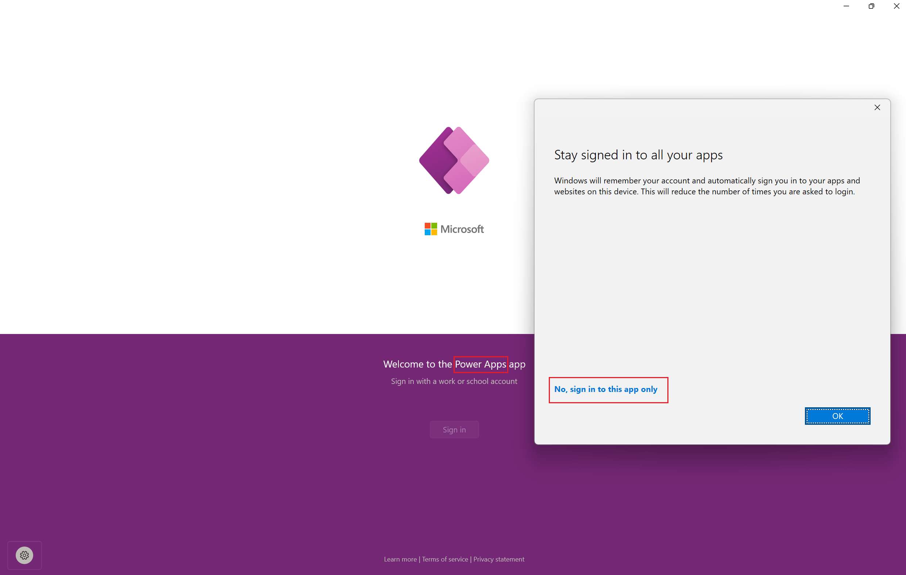

# SITAO: SignInToAppOnly Automation Utility
Welcome to the SITAO (SignInToAppOnly) utility! This tool is designed to help users automate the sign-in process to applications by monitoring for specific windows and hyperlinks.

## Features
- Automated Window Monitoring: Continuously scans for a window with the specified title.
- Hyperlink Interaction: Automatically detects and interacts with a hyperlink within the identified window.
- Ease of Use: Just pass the window title and hyperlink text as arguments, and let SITAO handle the rest.

## How to use it 
SITAO simplifies your sign-in processes by automating interactions with applications requiring manual sign-ins through graphical interfaces. To leverage SITAO, you need to supply at least one argument: the text of the hyperlink you wish to invoke. Optionally, you can also specify the exact name of the window you want to target if you wish to narrow down the search to a specific application window.
```
SignInToAppOnly.exe <hyperlinkText> [optional: windowName]
```
This command-line tool is ideal for users who often find themselves repeatedly performing manual sign-ins across various applications. With SITAO, you can automate these steps effortlessly, thanks to its smooth integration with the Windows Automation API.

Embrace the convenience SITAO offers and start streamlining your sign-in processes today!


## Example of Power Apps
```
SignInToAppOnly.exe "No, sign in to this app only" "Power Apps"
```


## Note
This tool is designed exclusively for testing and experimentation and should not be regarded as a dependable solution.

It's important to use it cautiously to avoid causing significant disruptions or interference with the targeted application, particularly in cases where the application employs measures to prevent automation. Moreover, continuous monitoring and automated interactions might be perceived as suspicious activity by certain antivirus programs. Always make sure that your approach to automation aligns with the application's terms of service and privacy policy.
